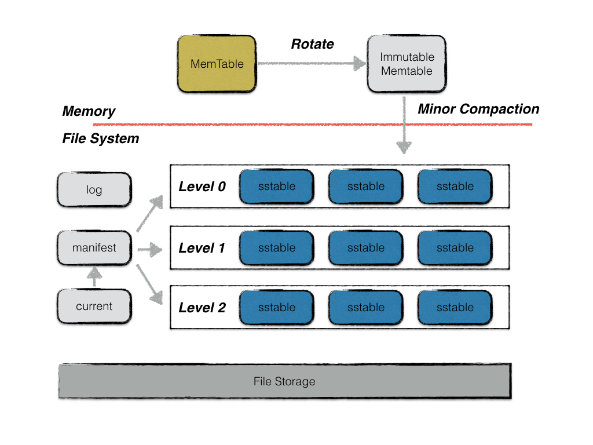
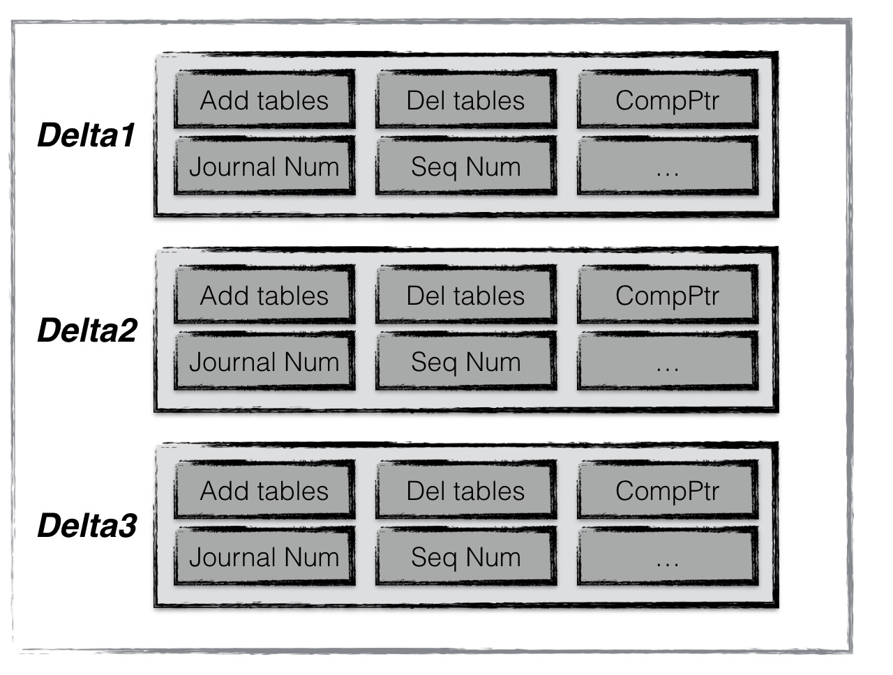

基本概念
========

leveldb是一个写性能十分优秀的存储引擎，是典型的LSM树(Log Structured-Merge Tree)实现。LSM树的核心思想就是放弃部分读的性能，换取最大的写入能力。

LSM树写性能极高的原理，简单地来说就是尽量减少随机写的次数。对于每次写入操作，并不是直接将最新的数据驻留在磁盘中，而是将其拆分成（1）一次日志文件的顺序写（2）一次内存中的数据插入。leveldb正是实践了这种思想，将数据首先更新在内存中，当内存中的数据达到一定的阈值，将这部分数据真正刷新到磁盘文件中，因而获得了极高的写性能（顺序写60MB/s,
随机写45MB/s）。

在本文中，将介绍一下leveldb的基本架构、概念。

整体架构
--------

leveldb中主要由以下几个重要的部件构成：

-  memtable
-  immutable memtable
-  log(journal)
-  sstable
-  manifest
-  current

memtable
~~~~~~~~

之前提到，leveldb的一次写入操作并不是直接将数据刷新到磁盘文件，而是首先写入到内存中作为代替，memtable就是一个在内存中进行数据组织与维护的结构。memtable中，所有的数据按\ **用户定义的排序方法**\ 排序之后按序存储，等到其存储内容的容量达到阈值时（默认为4MB），便将其转换成一个\ **不可修改**\ 的memtable，与此同时创建一个新的memtable，供用户继续进行读写操作。memtable底层使用了一种\ `跳表 <https://zh.wikipedia.org/wiki/%E8%B7%B3%E8%B7%83%E5%88%97%E8%A1%A8>`__\ 数据结构，这种数据结构效率可以比拟二叉查找树，绝大多数操作的时间复杂度为O(log
n)。

immutable memtable
~~~~~~~~~~~~~~~~~~

memtable的容量到达阈值时，便会转换成一个不可修改的memtable，也称为immutable
memtable。这两者的结构定义完全一样，区别只是immutable
memtable是只读的。当一个immutable
memtable被创建时，leveldb的后台压缩进程便会将利用其中的内容，创建一个sstable，持久化到磁盘文件中。

log
~~~

leveldb的写操作并不是直接写入磁盘的，而是首先写入到内存。假设写入到内存的数据还未来得及持久化，leveldb进程发生了异常，抑或是宿主机器发生了宕机，会造成用户的写入发生丢失。因此leveldb在写内存之前会首先将所有的写操作写到日志文件中，也就是log文件。当以下异常情况发生时，均可以通过日志文件进行恢复：

1. 写log期间进程异常；
2. 写log完成，写内存未完成；
3. write动作完成（即log、内存写入都完成）后，进程异常；
4. Immutable memtable持久化过程中进程异常；
5. 其他压缩异常（较为复杂，首先不在这里介绍）；

当第一类情况发生时，数据库重启读取log时，发现异常日志数据，抛弃该条日志数据，即视作这次用户写入失败，保障了数据库的一致性；

当第二类，第三类，第四类情况发生了，均可以通过redo日志文件中记录的写入操作完成数据库的恢复。

每次日志的写操作都是一次顺序写，因此写效率高，整体写入性能较好。

此外，leveldb的\ **用户写操作的原子性**\ 同样通过日志来实现。

sstable
~~~~~~~

虽然leveldb采用了先写内存的方式来提高写入效率，但是内存中数据不可能无限增长，且日志中记录的写入操作过多，会导致异常发生时，恢复时间过长。因此内存中的数据达到一定容量，就需要将数据持久化到磁盘中。除了某些元数据文件，leveldb的数据主要都是通过sstable来进行存储。

虽然在内存中，所有的数据都是按序排列的，但是当多个memetable数据持久化到磁盘后，对应的不同的sstable之间是存在交集的，在读操作时，需要对所有的sstable文件进行遍历，严重影响了读取效率。因此leveldb后台会“定期“整合这些sstable文件，该过程也称为compaction。随着compaction的进行，sstable文件在逻辑上被分成若干层，由内存数据直接dump出来的文件称为level
0层文件，后期整合而成的文件为level i
层文件，这也是leveldb这个名字的由来。

注意，所有的sstable文件本身的内容是不可修改的，这种设计哲学为leveldb带来了许多优势，简化了很多设计。具体将在接下来的文章中具体解释。

manifest
~~~~~~~~

leveldb中有个版本的概念，一个版本中主要记录了每一层中所有文件的元数据，元数据包括（1）文件大小（2）最大key值（3）最小key值。该版本信息十分关键，除了在查找数据时，利用维护的每个文件的最大／小key值来加快查找，还在其中维护了一些进行compaction的统计值，来控制compaction的进行。

以goleveldb为例，一个文件的元数据主要包括了最大最小key，文件大小等信息；

.. code:: go

    // tFile holds basic information about a table.
    type tFile struct {
        fd         storage.FileDesc
        seekLeft   int32
        size       int64
        imin, imax internalKey
    }

一个版本信息主要维护了每一层所有文件的元数据。

.. code:: go

    type version struct {
        s *session // session - version

        levels []tFiles // file meta

        // Level that should be compacted next and its compaction score.
        // Score < 1 means compaction is not strictly needed. These fields
        // are initialized by computeCompaction()
        cLevel int // next level
        cScore float64 // current score

        cSeek unsafe.Pointer

        closing  bool
        ref      int
        released bool
    }

当每次\ **compaction完成**\ （或者换一种更容易理解的说法，当每次sstable文件有新增或者减少），leveldb都会创建一个新的version，创建的规则是:

versionNew = versionOld + versionEdit

versionEdit指代的是基于旧版本的基础上，变化的内容（例如新增或删除了某些sstable文件）。

**manifest文件就是用来记录这些versionEdit信息的**\ 。一个versionEdit数据，会被编码成一条记录，写入manifest文件中。例如下图便是一个manifest文件的示意图，其中包含了3条versionEdit记录，每条记录包括（1）新增哪些sst文件（2）删除哪些sst文件（3）当前compaction的下标（4）日志文件编号（5）操作seqNumber等信息。通过这些信息，leveldb便可以在启动时，基于一个空的version，不断apply这些记录，最终得到一个上次运行结束时的版本信息。

current
~~~~~~~

这个文件的内容只有一个信息，就是记载当前的manifest文件名。

因为每次leveldb启动时，都会创建一个新的Manifest文件。因此数据目录可能会存在多个Manifest文件。Current则用来指出哪个Manifest文件才是我们关心的那个Manifest文件。
