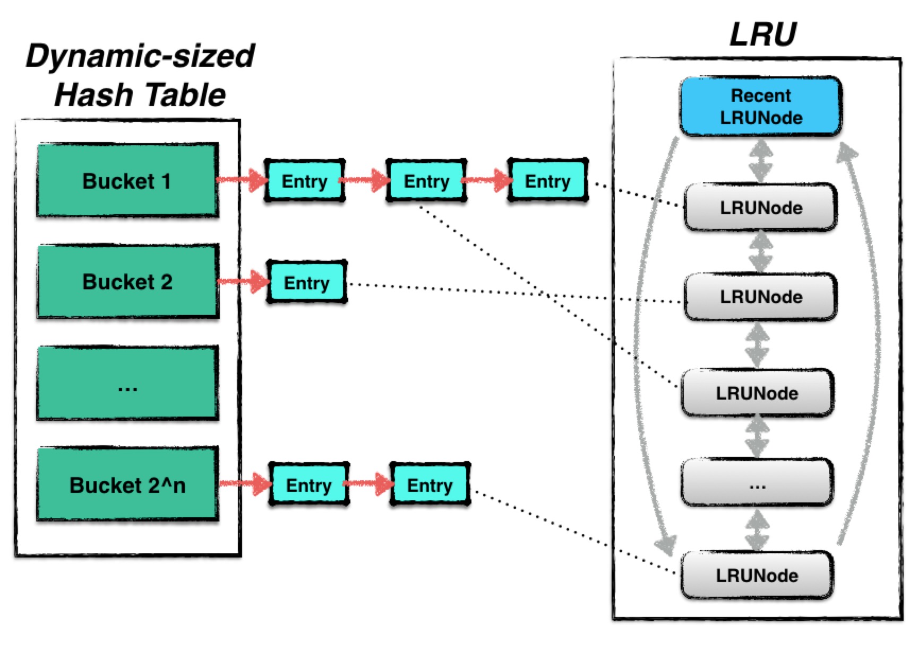

## 缓存

缓存对于一个数据库读性能的影响十分巨大，倘若leveldb的每一次读取都会发生一次磁盘的IO，那么其整体效率将会非常低下。

Leveldb中使用了一种基于LRUCache的缓存机制，用于缓存：

* 已打开的sstable文件对象和相关元数据；
* sstable中的dataBlock的内容；

使得在发生读取热数据时，尽量在cache中命中，避免IO读取。

### Cache结构

goLeveldb中使用的cache是一种LRUcache，其结构由两部分内容组成：

* Hash table：用来存储数据；
* LRU：用来维护数据项的新旧信息；

其中Hash table是基于Yujie Liu等人的论文《Dynamic-Sized Nonblocking Hash Table》实现的，用来存储数据。由于hash表一般需要保证插入、删除、查找等操作的时间复杂度为 O(1)，然而当hash表的数据量增大时，需要对hash表进行resize。基于该文章实现的hash table可以实现resize的过程中不阻塞正常的并发使用。

LRU中则根据Least Recently Used原则进行数据新旧信息的维护，当整个cache中存储的数据容量达到上限时，便会根据LRU算法自动删除最旧的数据，使得整个cache的存储容量保持一个常量。

### Dynamic-sized NonBlocking Hash table

在hash表进行resize的过程中，保持Lock-Free是一件非常困难的事。

一个hash表通常由若干个bucket组成，每一个bucket中会存储若干条被散列至此的数据项。当hash表进行resize时，需要将“旧”桶中的数据读出，并且重新散列至另外一个“新”桶中。假设这个过程不是一个原子操作，那么会导致此刻其他的读、写请求的结果发生异常，甚至导致数据丢失的情况发生。

### LRU

