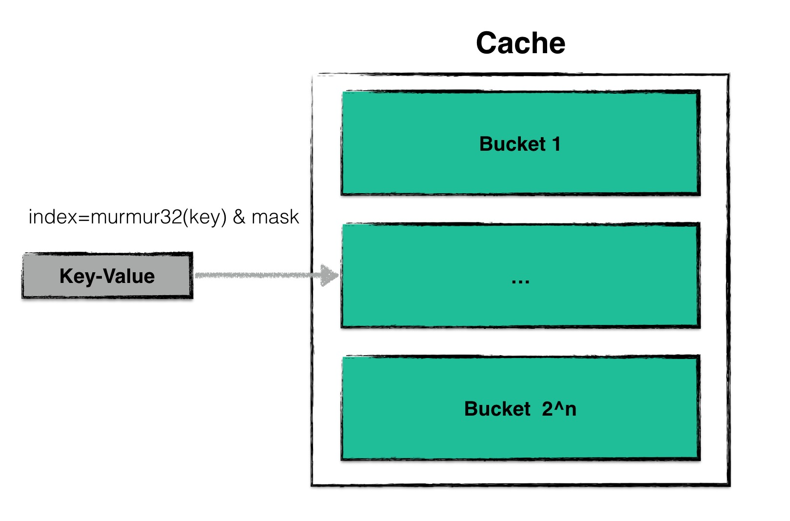
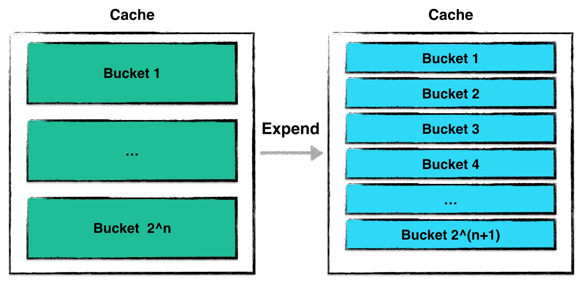

## 缓存系统

缓存对于一个数据库读性能的影响十分巨大，倘若leveldb的每一次读取都会发生一次磁盘的IO，那么其整体效率将会非常低下。

Leveldb中使用了一种基于LRUCache的缓存机制，用于缓存：

* 已打开的sstable文件对象和相关元数据；
* sstable中的dataBlock的内容；

使得在发生读取热数据时，尽量在cache中命中，避免IO读取。在介绍如何缓存、利用这些数据之前，我们首先介绍一下leveldb使用的cache是如何实现的。

### Cache结构

leveldb中使用的cache是一种LRUcache，其结构由两部分内容组成：

* Hash table：用来存储数据；
* LRU：用来维护数据项的新旧信息；


其中Hash table是基于Yujie Liu等人的论文《Dynamic-Sized Nonblocking Hash Table》实现的，用来存储数据。由于hash表一般需要保证插入、删除、查找等操作的时间复杂度为 O(1)。

当hash表的数据量增大时，为了保证这些操作仍然保有较为理想的操作效率，需要对hash表进行resize，即改变hash表中bucket的个数，对所有的数据进行重散列。

基于该文章实现的hash table可以实现resize的过程中**不阻塞其他并发的读写请求**。

LRU中则根据Least Recently Used原则进行数据新旧信息的维护，当整个cache中存储的数据容量达到上限时，便会根据LRU算法自动删除最旧的数据，使得整个cache的存储容量保持一个常量。

### Dynamic-sized NonBlocking Hash table

在hash表进行resize的过程中，保持Lock-Free是一件非常困难的事。

一个hash表通常由若干个bucket组成，每一个bucket中会存储若干条被散列至此的数据项。当hash表进行resize时，需要将“旧”桶中的数据读出，并且重新散列至另外一个“新”桶中。假设这个过程不是一个原子操作，那么会导致此刻其他的读、写请求的结果发生异常，甚至导致数据丢失的情况发生。

因此，liu等人提出了一个新颖的概念：**一个bucket的数据是可以冻结的**。

这个特点极大地简化了hash表在resize过程中在不同bucket之间转移数据的复杂度。

#### 散列



该哈希表的散列与普通的哈希表一致，都是借助散列函数，将用户需要查找、更改的数据散列到某一个哈希桶中，并在哈希桶中进行操作。

由于一个哈希桶的容量是有限的（一般不大于32个数据），因此在哈希桶中进行插入、查找的时间复杂度可以视为是常量的。

#### 扩大



当cache中维护的数据量太大时，会发生哈希表扩张的情况。以下两种情况是为“cache中维护的数据量过大”：

* 整个cache中，数据项（node）的个数超过预定的阈值（默认初始状态下哈希桶的个数为16个，每个桶中可存储32个数据项，即总量的阈值为哈希桶个数乘以每个桶的容量上限）；
* 当cache中出现了数据不平衡的情况。当某些桶的数据量超过了32个数据，即被视作数据发生散列不平衡。当这种不平衡累积值超过预定的阈值（128）个时，就需要进行扩张；

一次扩张的过程为：

1. 计算新哈希表的哈希桶个数（扩大一倍）；
2. 创建一个空的哈希表，并将旧的哈希表（主要为所有哈希桶构成的数组）转换一个“过渡期”的哈希表，表中的每个哈希桶都被“冻结”；
3. 后台利用“过渡期”哈希表中的“被冻结”的哈希桶信息对新的哈希表进行内容构建；

**值得注意的是，在完成新的哈希表构建的整个过程中，哈希表并不是拒绝服务的，所有的读写操作仍然可以进行**。

**哈希表扩张过程中，最小的封锁粒度为哈希桶级别**。

当有新的读写请求发生时，若被散列之后得到的哈希桶仍然未构建完成，则“主动”进行构建，并将构建后的哈希桶填入新的哈希表中。后台进程构建到该桶时，发现已经被构建了，则无需重复构建。

因此如上图所示，哈希表扩张结束，哈希桶的个数增加了一倍，于此同时仍然可以对外提供读写服务，仅仅需要哈希桶级别的封锁粒度就可以保证所有操作的一致性跟原子性。

**构建哈希桶**

当哈希表扩张时，构建一个新的哈希桶其实就是将一个旧哈希桶中的数据拆分成两个新的哈希桶。

拆分的规则很简单。由于一次散列的过程为：

1. 利用散列函数对数据项的key值进行计算；
2. 将第一步得到的结果取哈希桶个数的余，得到哈希桶的ID；

因此拆分时仅需要将数据项key的散列值对新的哈希桶个数取余即可。

#### 缩小

当哈希表中数据项的个数少于哈希桶的个数时，需要进行收缩。收缩时，哈希桶的个数变为原先的一半，2个旧哈希桶的内容被合并成一个新的哈希桶，过程与扩张类似，在这里不展开详述。

### LRU

除了利用哈希表来存储数据以外，leveldb还利用LRU来管理数据。

Leveldb中，LRU利用一个双向循环链表来实现。每一个链表项称之为`LRUNode`。

```Go
type lruNode struct {
	n   *Node // customized node
	h   *Handle
	ban bool

	next, prev *lruNode
}
```

一个`LRUNode`除了维护一些链表中前后节点信息以外，还存储了一个哈希表中数据项的指针，通过该指针，当某个节点由于LRU策略被驱逐时，从哈希表中“安全的”删除数据内容。

LRU提供了以下几个接口：

* Promote

若一个hash表中的节点是第一次被创建，则为该节点创建一个`LRUNode`，并将`LRUNode`至于链表的头部，表示为最新的数据；

若一个hash表中的节点之前就有相关的`LRUNode`存在与链表中，将该`LRUNode`移至链表头部；

若因为新增加一个LRU数据，导致超出了容量上限，就需要根据策略清除部分节点。

* Ban

将hash表节点对应的`LRUNode`从链表中删除，并“尝试”从哈希表中删除数据。

由于该哈希表节点的数据可能被其他线程正在使用，因此需要查看该数据的引用计数，只有当引用计数为0时，才可以真正地从哈希表中进行删除。

### 缓存数据

leveldb利用上述的cache结构来缓存数据。其中：

* cache：来缓存已经被打开的sstable文件句柄以及元数据（默认上限为500个）；
* bcache：来缓存被读过的sstable中dataBlock的数据（默认上限为8MB）;

当一个sstable文件需要被打开时，首先从cache中寻找是否已经存在相关的文件句柄，若存在则无需重复打开；若不存在，则从打开相关文件，并将（1）indexBlock数据，（2）metaIndexBlock数据等相关元数据进行预读。

### 参考文献

* "Dynamic-Sized Nonblocking Hash Tables", by Yujie Liu, Kunlong Zhang, and Michael Spear. ACM Symposium on Principles of Distributed Computing, Jul 2014.

