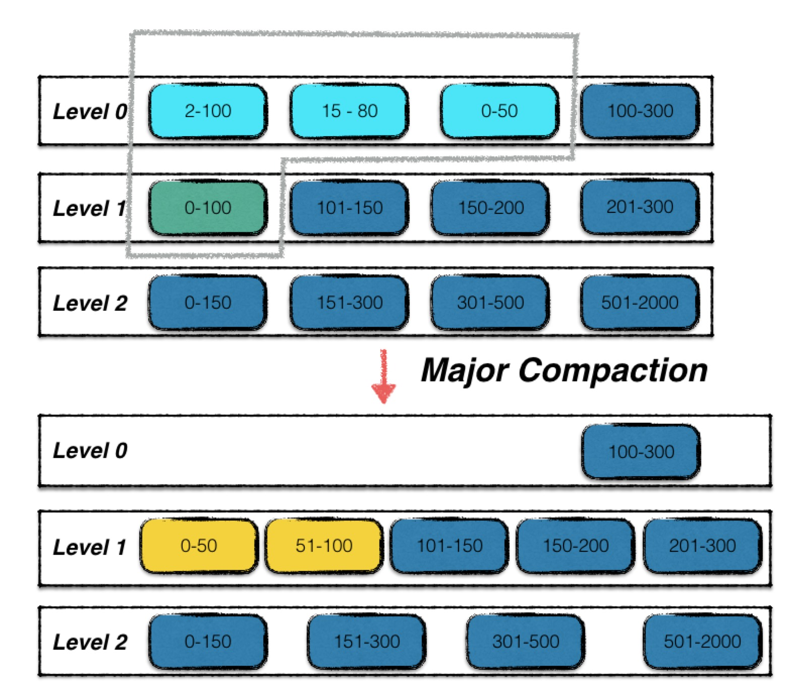
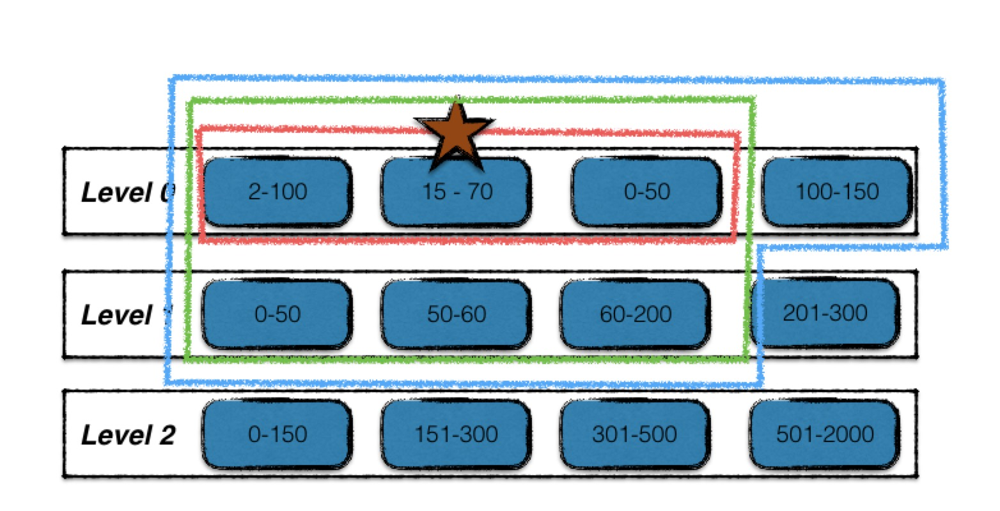
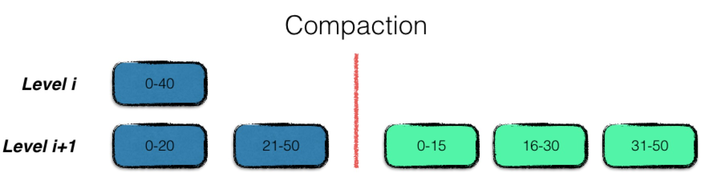

compaction
==========

Compaction是leveldb最为复杂的过程之一，同样也是leveldb的性能瓶颈之一。其本质是一种内部数据重合整合的机制，同样也是一种平衡读写速率的有效手段，因此在下文中，首先介绍下leveldb中设计compaction的原由，再来介绍下compaction的具体过程。

Compaction的作用
----------------

数据持久化
~~~~~~~~~~

leveldb是典型的LSM树实现，因此需要对内存中的数据进行持久化。一次内存数据的持久化过程，在leveldb中称为\ ***Minor
Compaction***\ 。

一次minor
compaction的产出是一个0层的sstable文件，其中包含了所有的内存数据。但是若干个0层文件中是可能存在数据overlap的。

提高读写效率
~~~~~~~~~~~~

正如前面的文章提到，leveldb是一个写效率十分高的存储引擎，存储的过程非常简单，只需要一次顺序的文件写和一个时间复杂度为O(log
n)的内存操作即可。

相比来说，leveldb的读操作就复杂不少。首先一到两次读操作需要进行一个复杂度为O(log
n)的查询操作。若没有在内存中命中数据，则需要在按照数据的新旧程度在0层文件中依次进行查找\ **遍历**\ 。由于0层文件中可能存在overlap，因此在最差情况下，可能需要遍历所有的文件。

假设leveldb中就是以这样的方式进行数据维护，那么随着运行时间的增长，0层的文件个数会越来越多，在最差的情况下，查询一个数据需要遍历\ **所有的数据文件**\ ，这显然是不可接受的。因此leveldb设计了一个\ ***Major
Compaction***\ 的过程，将0层中的文件合并为若干个没有数据重叠的1层文件。

对于没有数据重叠的文件，一次查找过程就可以进行优化，最多只需要一个文件的遍历即可完成。因此，leveldb设计compaction的目的之一就是为了\ **提高读取的效率**\ 。

平衡读写差异
~~~~~~~~~~~~

有了minor compaction和major
compaction，所有的数据在后台都会被规定的次序进行整合。但是一次major
compaction的过程其本质是一个\ **多路归并**\ 的过程，既有大量的磁盘读开销，也有大量的磁盘写开销，显然这是一个严重的性能瓶颈。

但是当用户写入的速度始终大于major
compaction的速度时，就会导致0层的文件数量还是不断上升，用户的读取效率持续下降。所以leveldb中规定：

-  当0层文件数量超过\ ``SlowdownTrigger``\ 时，写入的速度主要减慢；
-  当0层文件数量超过\ ``PauseTrigger``\ 时，写入暂停，直至Major
   Compaction完成；

故compaction也可以起到平衡读写差异的作用。

整理数据
~~~~~~~~

leveldb的每一条数据项都有一个版本信息，标识着这条数据的新旧程度。这也就意味着同样一个key，在leveldb中可能存在着多条数据项，且每个数据项包含了不同版本的内容。

为了尽量减少数据集所占用的磁盘空间大小，leveldb在major
compaction的过程中，对不同版本的数据项进行合并。

Compaction过程
--------------

由上述所示，compaction分为两类：

-  minor compaction
-  major compaction

这两类compaction负责在不同的场景下进行不同的数据整理。

Minor Compaction
~~~~~~~~~~~~~~~~

一次minor
compaction非常简单，其本质就是将一个内存数据库中的所有数据持久化到一个磁盘文件中。

.. figure:: ./pic/minor_compaction.jpeg
   :alt: 

每次minor
compaction结束后，都会生成一个新的sstable文件，也意味着\ **Leveldb的版本状态发生了变化，会进行一个版本的更替**\ 。有关版本控制的内容，将在接下去一篇文章中详细展开。

值得注意的是，minor
compaction是一个时效性要求非常高的过程，要求其在尽可能短的时间内完成，否则就会堵塞正常的写入操作，因此\ **minor
compaction的优先级高于major compaction**\ 。当进行minor
compaction的时候有major compaction正在进行，则会首先暂停major
compaction。

Major Compaction
~~~~~~~~~~~~~~~~

相比于minor compaction，major
compaction就会复杂地多。首先看一下一次major compaction的示意图。

0层中浅蓝色的三个sstable文件，加上1层中的绿色的sstable文件，四个文件进行了合并，输出成两个按序组织的新的1层sstable文件进行替换。

**条件**

那么什么时候，会触发leveldb进行major
compaction呢。总结地来说为以下三个条件：

-  当0层文件数超过预定的上限（默认为4个）；
-  当level i层文件的总大小超过(10 ^ i) MB；
-  当某个文件无效读取的次数过多；

*0层文件个数规定*

由于compaction的其中一个目的是为了提高读取的效率，因此leveldb不允许0层存在过多的文件数，一旦超过了上限值，即可进行major
compaction。

*非0层文件数据大小限制*

对于level i（i >=
1）的情况来说，一个读取最多只会访问一个sstable文件，因此，本身对于读取效率的影响不会太大。针对于这部分数据发生compaction的条件，从\ **提升读取效率**\ 转变成了\ **降低compaction的IO开销**\ 。

假设leveldb的合并策略只有第一条，那么会导致1层文件的个数越来越多或者总的数据量越来越大，而通常一次合并中，\ **0层文件key的取值范围是很大的**\ ，\ **导致每一次0层文件与1层文件进行合并时，1层文件输入文件的总数据量非常庞大**\ 。所以不仅需要控制0层文件的个数，同样，每一层文件的总大小同样需要进行控制，使得每次进行compaction时，IO开销尽量保持常量。

故leveldb规定，1层文件总大小上限为10MB，2层为100MB，依次类推，最高层（7层）没有限制。

*文件读取次数过多*

以上两个机制能够保证随着合并的进行，数据是严格下沉的，但是仍然存在一个问题。

    假设0层文件完成合并之后，1层文件同时达到了数据上限，同时需要进行合并。

    更加糟糕的是，在最差的情况下，0-n层的文件同时达到了合并的条件，每一层都需要进行合并。

其中一种优化机制是：

-  source层的文件个数只有一个；
-  source层文件与source+1层文件没有重叠；
-  source层文件与source+2层的文件重叠部分不超过10个文件；

当满足这几个条件时，可以将souce层的该文件直接移至source+1层。

但是该条件非常苛刻，还是无法解决上述问题。为了避免可能存在这种“巨大”的合并开销，leveldb引入了第三个机制：”错峰合并“。

那么（1）如何找寻这种适合错峰合并的文件（2）以及如果判断哪个时机是适合进行错峰合并的呢？

对于问题（1）Leveldb的作者认为，一个文件一次查询的开销为10ms,
**若某个文件的查询次数过多，且查询在该文件中不命中**,
那么这种行为就可以视为无效的查询开销，这种文件就可以进行错峰合并。

对于问题（2），对于一个1MB的文件，对其合并的开销为25ms。因此当一个文件1MB的文件无效查询超过25次时，便可以对其进行合并。

    对于一个1MB的文件，其合并开销为（1）source层1MB的文件读取，（2）source+1层
    10-12MB的文件读取（3）source+1层10-12MB的文件写入。

    总结25MB的文件IO开销，除以100MB／s的文件IO速度，估计开销为25ms。

**采样探测**

在每个sstable文件的元数据中，还有一个额外的字段\ ``seekLeft``\ ，默认为文件的大小除以16KB。

leveldb在正常的数据访问时，会顺带进行采样探测。正常的数据访问包括（1）用户直接调用Get接口（2）用户使用迭代器进行访问。

采样的规则：

记录本次访问的第一个sstable文件。若在该文件中访问命中，则不做任何处理；若在该文件中访问不命中，则对
该文件的\ ``seekLeft``\ 标志做减一操作。

直到某一个文件的\ ``seekLeft``\ 标志减少到0时，触发对该文件的错峰合并。

故以上三种机制可以保障每次进行compaction的时候，总体开销不会呈现上升趋势。

过程
~~~~

整个compaction可以简单地分为以下几步：

1. 寻找合适的输入文件；
2. 根据key重叠情况扩大输入文件集合；
3. 多路合并；
4. 积分计算；

**寻找输入文件**\ ：

不同情况下发起的合并动作，其初始的输入文件不同。

对于\ *level 0层文件数过多引发的合并场景或由于level
i层文件总量过大的合并场景*\ ，采用轮转的方法选择起始输入文件，记录了上一次该层合并的文件的最大key，下一次则选择在此key之后的首个文件。

对于\ *错峰合并*\ ，起始输入文件则为该查询次数过多的文件。

**扩大输入文件集合**

该过程如下：

1. 红星标注的为起始输入文件；
2. 在level
   i层中，查找与起始输入文件有key重叠的文件，如图中红线所标注，最终构成level
   i层的输入文件；
3. 利用level i层的输入文件，在level
   i+1层找寻有key重叠的文件，结果为绿线标注的文件，构成level
   i，i+1层的输入文件；
4. 最后利用两层的输入文件，在不扩大level i+1输入文件的前提下，查找level
   i层的有key重叠的文件，结果为蓝线标准的文件，构成最终的输入文件；

**多路合并**\ ：

多路合并的过程比较简单，即将level i层的文件，与level
i+1层的文件中的数据项，按序整理之后，输出到level
i+1层的若干个新文件中，即合并完成。

注意在整理的过程中，需要将冗余的数据进行清理，即同一条数据的多个版本信息，只保留最新的那一份。

但是要注意，某些仍然在使用的旧版本的数据，在此时不能立刻删除，而得等到用户使用结束，释放句柄后，根据引用计数来进行清除。

**积分计算**

每一次compaction都会消除若干source层的旧文件，新增source+1层的新文件，因此触发进行合并的条件状态可能也发生了变化。故在leveldb中，使用了计分牌来维护每一层文件的文件个数及数据总量信息，来\ **挑选出下一个需要进行合并的层数**\ 。

计分的规则很简单：

-  对于0层文件，该层的分数为文件总数／4；
-  对于非0层文件，该层的分数为文件数据总量／数据总量上限；

将得分最高的层数记录，若该得分超过1，则为下一次进行合并的层数；

用户行为
--------

由于leveldb内部进行compaction时有trivial
move优化，且根据内部的文件格式组织，用户在使用leveldb时，可以尽量将大批量需要写入的数据进行预排序，利用空间局部性，尽量减少多路合并的IO开销。
