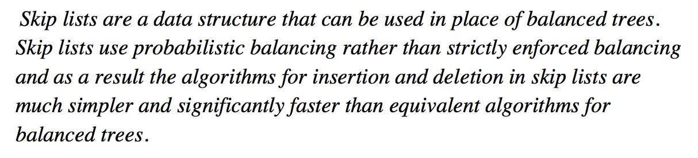
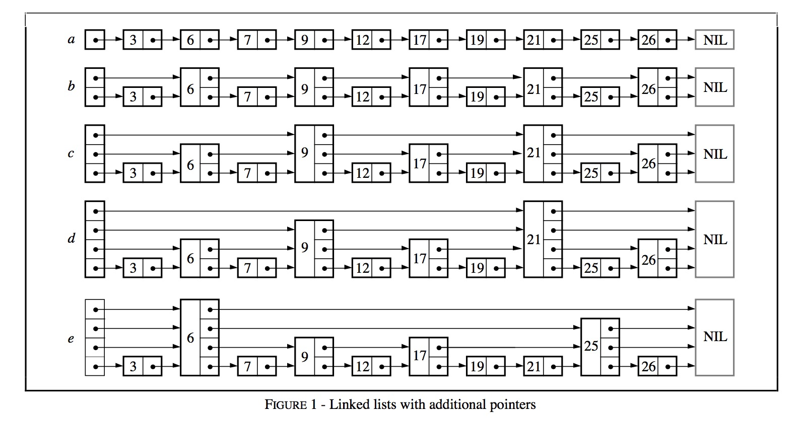
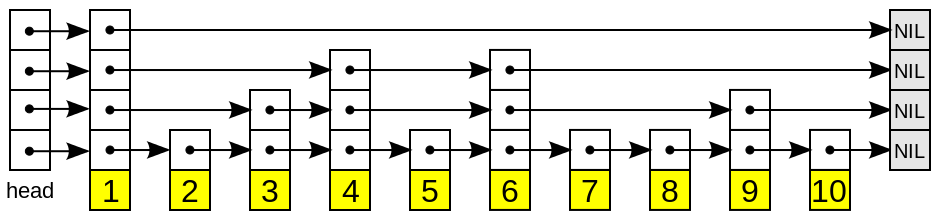
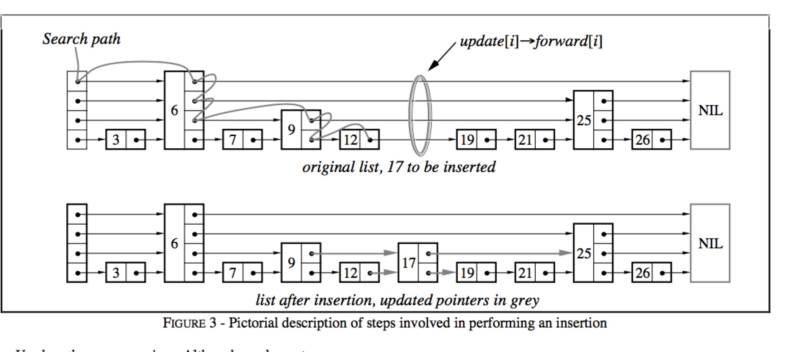

## 内存数据库

leveldb中内存数据库用来维护有序的key-value对，其底层是利用跳表实现，绝大多数操作（读／写）的时间复杂度均为O(log n)，有着与平衡树相媲美的操作效率，但是从实现的角度来说简单许多，因此在本文中将介绍一下内存数据库的实现细节。

### 跳表

#### 概述

跳表（SkipList）是由William Pugh提出的。他在论文《Skip lists: a probabilistic alternative to balanced trees》中详细地介绍了有关跳表结构、插入删除操作的细节。

这种数据结构是利用**概率均衡**技术，加快简化插入、删除操作，且保证绝大大多操作均拥有O(log n)的良好效率。

 作者在他的论文中这样介绍跳表：



平衡树（以红黑树为代表）是一种非常复杂的数据结构，为了维持树结构的平衡，获取稳定的查询效率，平衡树每次插入可能会涉及到较为复杂的节点旋转等操作。作者设计跳表的目的就是借助**概率平衡**，来构建一个快速且简单的数据结构，取代平衡树。



作者从链表讲起，一步步引出了跳表这种结构的由来。

图a中，所有元素按序排列，被存储在一个链表中，则一次查询之多需要比较N个链表节点；

图b中，每隔2个链表节点，新增一个额外的指针，该指针指向间距为2的下一个节点，如此以来，借助这些额外的指针，一次查询至多只需要⌈n/2⌉ + 1次比较；

图c中，在图b的基础上，每隔4个链表节点，新增一个额外的指针，指向间距为4的下一个节点，一次查询至多需要⌈n/4⌉ + 2次比较；

作者推论，若每隔2^ i个节点，新增一个辅助指针，最终一次节点的查询效率为O(log n)。但是这样不断地新增指针，使得一次插入、删除操作将会变得非常复杂。

一个拥有*k*个指针的结点称为一个*k*层结点（*level k node*）。按照上面的逻辑，50%的结点为1层节点，25%的结点为2层节点，12.5%的结点为3层节点。若保证每层节点的分布如上述概率所示，则仍然能够相同的查询效率。图e便是一个示例。

维护这些辅助指针将会带来较大的复杂度，因此作者将每一层中，每个节点的辅助指针指向该层中下一个节点。故在插入删除操作时，只需跟操作链表一样，修改相关的前后两个节点的内容即可完成，作者将这种数据结构称为跳表。

####结构



一个跳表的结构示意图如上所示。

跳跃列表是按层建造的。底层是一个普通的**有序**链表。每个更高层都充当下面链表的"快速通道"，这里在层 *i* 中的元素按某个固定的概率 *p* (通常为0.5或0.25)出现在层 *i*+1 中。平均起来，每个元素都在 1/(1-*p*) 个列表中出现，而最高层的元素（通常是在跳跃列表前端的一个特殊的头元素）在 O(log1/*p*  *n*) 个列表中出现。

#### 查找



在介绍插入和删除操作之前，我们首先介绍查找操作，该操作是上述两个操作的基础。

例如图中，需要查找一个值为17的链表节点，查找的过程为：

* 首先根据跳表的高度选取最高层的头节点；
* 若跳表中的节点内容小于查找节点的内容，则取该层的下一个节点继续比较；
* 若跳表中的节点内容等于查找节点的内容，则直接返回；
* 若跳表中的节点内容大于查找节点的内容，且层高不为0，则降低层高，且从前一个节点开始，重新查找低一层中的节点信息；若层高为0，则返回当前节点，该节点的key大于所查找节点的key。

综合来说，就是利用稀疏的高层节点，快速定位到所需要查找节点的大致位置，再利用密集的底层节点，具体比较节点的内容。

#### 插入

插入操作借助于查找操作实现。


* 在查找的过程中，不断记录**每一层**的**前任节点**，如图中红色圆圈所表示的；
* 为新插入的节点随机产生层高（随机产生层高的算法较为简单，依赖最高层数和概率值p，可见下文中的代码实现）；
* 在合适的位置插入新节点（例如图中节点12与节点19之间），并依据查找时记录的前任节点信息，在每一层中，**以链表插入**的方式，将该节点插入到每一层的链接中。

**链表插入**指：将当前节点的Next值置为前任节点的Next值，将前任节点的Next值替换为当前节点。

```Go
func (p *DB) randHeight() (h int) {
	const branching = 4
	h = 1
	for h < tMaxHeight && p.rnd.Int()%branching == 0 {
		h++
	}
	return
}
```

####删除

跳表的删除操作较为简单，依赖查找过程找到该节点在整个跳表中的位置后，**以链表删除**的方式，在每一层中，删除该节点的信息。

**链表删除**指：将前任节点的Next值替换为当前节点的Next值，并将当前节点所占的资源释放。

#### 迭代

*向后遍历*

* 若迭代器刚被创建，则根据用户指定的查找范围[Start, Limit)找到一个符合条件的跳表节点；
* 若迭代器处于中部，则取出上一次访问的跳表节点的后继节点，作为本次访问的跳表节点（后继节点为最底层的后继节点）；
* 利用跳表节点信息（keyvalue数据偏移量，key，value值长度等），获取keyvalue数据；

*向前遍历*

* 若迭代器刚被创建，则根据用户指定的查找范围[Start, Limit）在跳表中找到最后一个符合条件的跳表节点；
* 若迭代器处于中部，则利用上一次访问的节点的key值，查找比该key值更小的跳表节点；
* 利用跳表节点信息（keyvalue数据偏移量，key，value值长度等），获取keyvalue数据；

### 内存数据库

在介绍完跳表这种数据结构的组织原理以后，我们介绍leveldb如何利用跳表来构建一个高效的内存数据库。

#### 键值编码

在介绍内存数据库之前，首先介绍一下内存数据库的键值编码规则。由于内存数据库本质是一个kv集合，且所有的数据项都是依据key值排序的，因此键值的编码规则尤为关键。

内存数据库中，key称为internalKey，其由三部分组成：

* 用户定义的key：这个key值也就是原生的key值；
* 序列号：leveldb中，每一次写操作都有一个sequence number，标志着写入操作的先后顺序。由于在leveldb中，可能会有多条相同key的数据项同时存储在数据库中，因此需要有一个序列号来标识这些数据项的新旧情况。序列号最大的数据项为最新值；
* 类型：标志本条数据项的类型，为更新还是删除；


####键值比较

内存数据库中所有的数据项都是按照键值比较规则进行排序的。这个比较规则可以由用户自己定制，也可以使用系统默认的。在这里介绍一下系统默认的比较规则。

默认的比较规则：

* 首先按照字典序比较用户定义的key（ukey），若用户定义key值大，整个internalKey就大；
* 若用户定义的key相同，则序列号大的internalKey值就小；

通过这样的比较规则，则所有的数据项首先按照用户key进行升序排列；当用户key一致时，按照序列号进行降序排列，这样可以保证首先读到序列号大的数据项。

#### 数据组织

以goleveldb为示例，内存数据库的定义如下：

```go
type DB struct {
	cmp comparer.BasicComparer
	rnd *rand.Rand

	mu     sync.RWMutex
	kvData []byte
	// Node data:
	// [0]         : KV offset
	// [1]         : Key length
	// [2]         : Value length
	// [3]         : Height
	// [3..height] : Next nodes
	nodeData  []int
	prevNode  [tMaxHeight]int
	maxHeight int
	n         int
	kvSize    int
}
```

其中kvData用来存储每一条数据项的key-value数据，nodeData用来存储每个跳表节点的**链接信息**。

nodeData中，每个跳表节点占用一段连续的存储空间，每一个字节分别用来存储特定的跳表节点信息。

* 第一个字节用来存储本节点key-value数据在kvData中对应的偏移量；
* 第二个字节用来存储本节点key值长度；
* 第三个字节用来存储本节点value值长度；
* 第四个字节用来存储本节点的层高；
* 第五个字节开始，用来存储每一层对应的下一个节点的索引值；

#### 基本操作

*Put*、*Get*、*Delete*、*Iterator*等操作均依赖于底层的跳表的基本操作实现，不再赘述。


