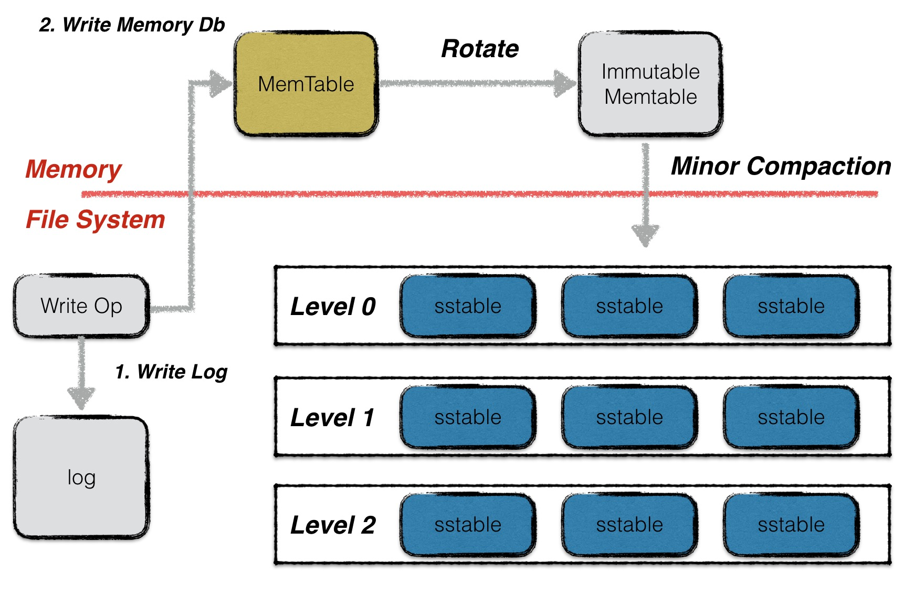
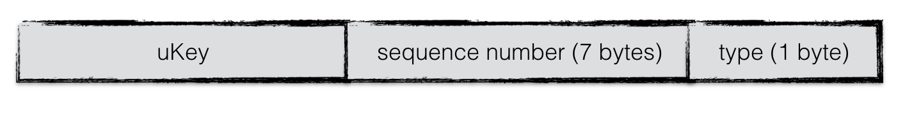
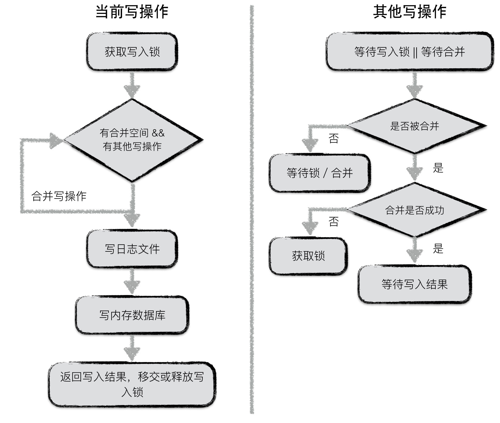
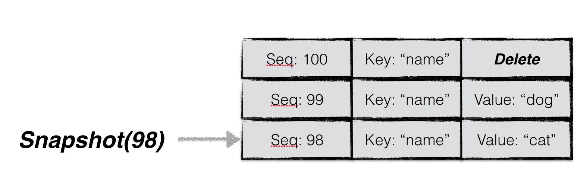
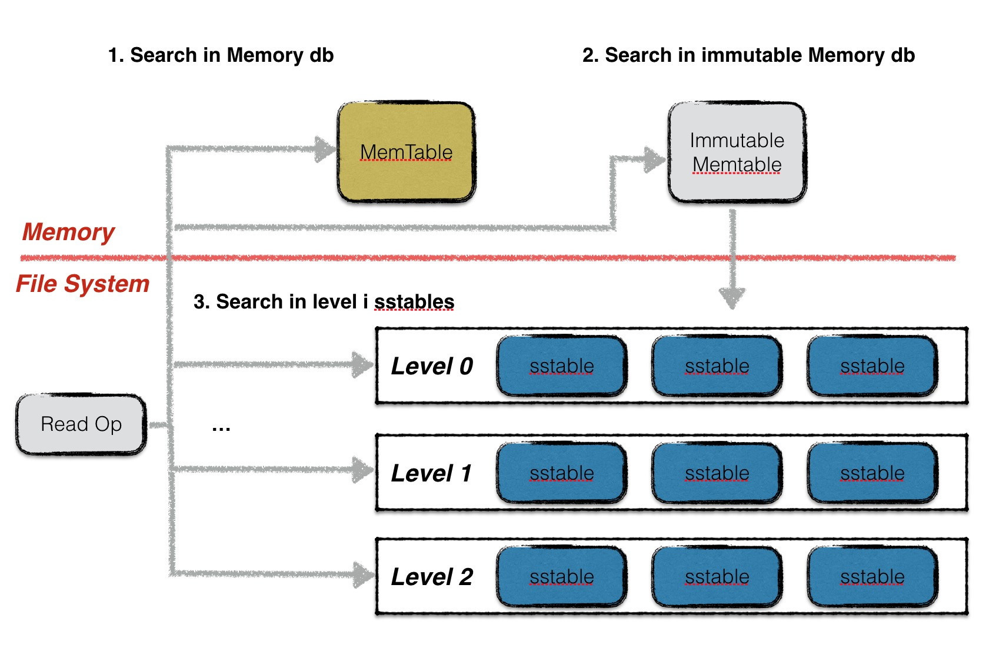

读写操作
========

写操作
------

leveldb以其优秀的写性能著名，在本文中就先来分析一下leveldb整个写入的流程，底层数据结构的支持以及为何能够获取极高的写入性能。

整体流程
~~~~~~~~

leveldb的一次写入分为两部分：

1. 将写操作写入日志；
2. 将写操作应用到内存数据库中；

之前已经阐述过为何这样的操作可以获得极高的写入性能，以及通过先写日志的方法能够保障用户的写入不丢失。

.. Note::
    其实leveldb仍然存在写入丢失的隐患。在写设置为非同步的情况下，在写完日志文件以后，操作系统并不是直接将这些数据真正落到磁盘中，而是暂时留在操作系统缓存中，因此当用户写入操作完成，操作系统还未来得及落盘的情况下，发生系统宕机，就会造成写丢失；但是若只是进程异常退出，则不存在该问题。

写类型
~~~~~~

leveldb对外提供的写入接口有：（1）Put（2）Delete两种。这两种本质对应同一种操作，Delete操作同样会被转换成一个value为空的Put操作。

除此以外，leveldb还提供了一个批量处理的工具Batch，用户可以依据Batch来完成批量的数据库更新操作，且这些操作是原子性的。

batch结构
~~~~~~~~~

无论是Put/Del操作，还是批量操作，底层都会为这些操作创建一个batch实例作为一个数据库操作的最小执行单元。因此首先介绍一下batch的组织结构。

在batch中，每一条数据项都按照上图格式进行编码。每条数据项编码后的第一位是这条数据项的类型（更新还是删除），之后是数据项key的长度，数据项key的内容；若该数据项不是删除操作，则再加上value的长度，value的内容。

batch中会维护一个size值，用于表示其中包含的数据量的大小。该size值为所有数据项key与value长度的累加，以及每条数据项额外的8个字节。这8个字节用于存储一条数据项额外的一些信息。

key值编码
~~~~~~~~~

当数据项从batch中写入到内存数据库中时，需要将一个key值的转换，即在leveldb内部，所有数据项的key是经过特殊编码的，这种格式称为internalKey。

internalkey在用户key的基础上，尾部追加了8个字节，用于存储（1）该操作对应的sequence
number（2）该操作的类型。

其中，每一个操作都会被赋予一个sequence
number。该计时器是在leveldb内部维护，每进行一次操作就做一个累加。由于在leveldb中，一次更新或者一次删除，采用的是append的方式，并非直接更新原数据。因此对应同样一个key，会有多个版本的数据记录，而最大的sequence
number对应的数据记录就是最新的。

此外，leveldb的快照（snapshot）也是基于这个sequence
number实现的，即每一个sequence number代表着数据库的一个版本。

合并写
~~~~~~

leveldb中，在面对并发写入时，做了一个处理的优化。在同一个时刻，只允许一个写入操作将内容写入到日志文件以及内存数据库中。为了在写入进程较多的情况下，减少日志文件的小写入，增加整体的写入性能，leveldb将一些“小写入”合并成一个“大写入”。

流程如下：

**第一个获取到写锁的写操作**

-  第一个写入操作获取到写入锁；
-  在当前写操作的数据量未超过合并上限，且有其他写操作pending的情况下，将其他写操作的内容合并到自身；
-  若本次写操作的数据量超过上限，或者无其他pending的写操作了，将所有内容统一写入日志文件，并写入到内存数据库中；
-  通知每一个被合并的写操作最终的写入结果，释放或移交写锁；

**其他写操作**\ ：

-  等待获取写锁或者被合并；
-  若被合并，判断是否合并成功，若成功，则等待最终写入结果；反之，则表明获取锁的写操作已经oversize了，此时，该操作直接从上个占有锁的写操作中接过写锁进行写入；
-  若未被合并，则继续等待写锁或者等待被合并；

原子性
~~~~~~

leveldb的任意一个写操作（无论包含了多少次写），其原子性都是由日志文件实现的。一个写操作中所有的内容会以一个日志中的一条记录，作为最小单位写入。

考虑以下两种异常情况：

1. 写日志未开始，或写日志完成一半，进程异常退出；
2. 写日志完成，进程异常退出；

前者中可能存储一个写操作的部分写已经被记载到日志文件中，仍然有部分写未被记录，这种情况下，当数据库重新启动恢复时，读到这条日志记录时，发现数据异常，直接丢弃或退出，实现了写入的原子性保障。

后者，写日志已经完成，写入日志的数据未真正持久化，数据库启动恢复时通过redo日志实现数据写入，仍然保障了原子性。

日志、内存数据库
~~~~~~~~~~~~~~~~

这部分数据将由《leveldb源码解析 - 日志》和《leveldb源码解析 -
内存数据库》两篇文章详细分析。

读操作
------

leveldb提供给用户两种进行读取数据的接口：

1. 直接通过\ ``Get``\ 接口读取数据；
2. 首先创建一个snapshot，基于该snapshot调用Get接口读取数据；

两者的本质是一样的，只不过第一种调用方式默认地以当前数据库的状态创建了一个snapshot，并基于此snapshot进行读取。

读者可能不了解snapshot（快照）到底是什么？简单地来说，就是数据库在某一个时刻的状态。基于一个快照进行数据的读取，读到的内容不会因为后续数据的更改而改变。

由于两种方式本质都是基于快照进行读取的，因此在介绍读操作之前，首先介绍快照。

快照
~~~~

快照代表着数据库某一个时刻的状态，在leveldb中，作者巧妙地用一个整型数来代表一个数据库状态。

在leveldb中，用户对同一个key的若干次修改（包括删除）是以维护多条数据项的方式进行存储的（直至进行compaction时才会合并成同一条记录），每条数据项都会被赋予一个序列号，代表这条数据项的新旧状态。一条数据项的序列号越大，表示其中代表的内容为最新值。

**因此，每一个序列号，其实就代表着leveldb的一个状态**\ 。换句话说，每一个序列号都可以作为一个状态快照。

当用户主动或者被动地创建一个快照时，leveldb会以当前最新的序列号对其赋值。例如图中用户在序列号为98的时刻创建了一个快照，并且基于该快照读取key为“name”的数据时，即便此刻用户将"name"的值修改为"dog"，再删除，用户读取到的内容仍然是“cat”。

所以，利用快照能够保证数据库进行并发的读写操作。

在获取到一个快照之后，leveldb会为本次查询的key构建一个internalKey（格式如上文所述），其中internalKey的seq字段使用的便是快照对应的seq。通过这种方式可以过滤掉\ **所有seq大于快照号的数据项**\ 。

读取
----

leveldb读取分为三步：

1. 在memory db中查找指定的key，若搜索到符合条件的数据项，结束查找；
2. 在冻结的memory
   db中查找指定的key，若搜索到符合条件的数据项，结束查找；
3. 按低层至高层的顺序在level
   i层的sstable文件中查找指定的key，若搜索到符合条件的数据项，结束查找，否则返回Not
   Found错误，表示数据库中不存在指定的数据；

   .. Note ::

    注意leveldb在每一层sstable中查找数据时，都是按序依次查找sstable的。

    0层的文件比较特殊。由于0层的文件中可能存在key重合的情况，因此在0层中，文件编号大的sstable优先查找。理由是文件编号较大的sstable中存储的总是最新的数据。

    非0层文件，一层中所有文件之间的key不重合，因此leveldb可以借助sstable的元数据（一个文件中最小与最大的key值）进行快速定位，每一层只需要查找一个sstable文件的内容。

在memory
db或者sstable的查找过程中，需要根据指定的序列号拼接一个internalKey，查找用户key一致，且seq号\ **不大于**\ 指定seq的数据，具体的查找过程可见《内存数据库》和《sstable》两篇文章。
