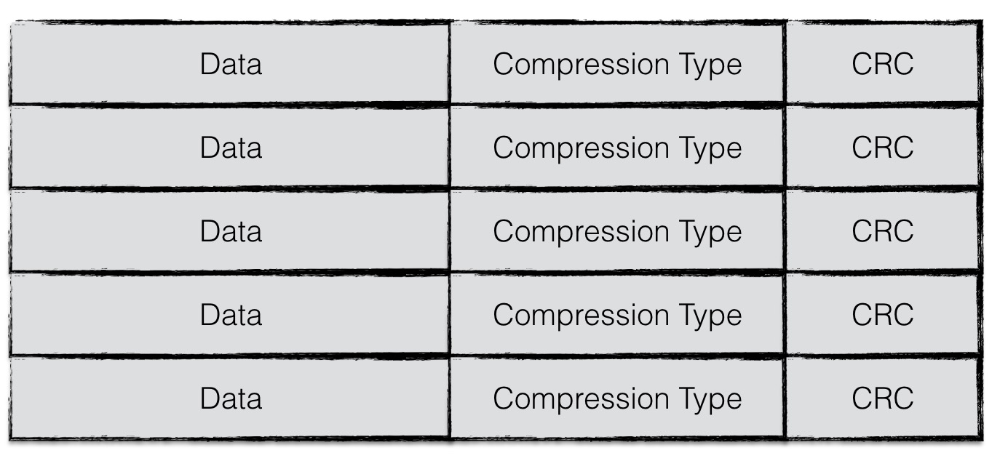
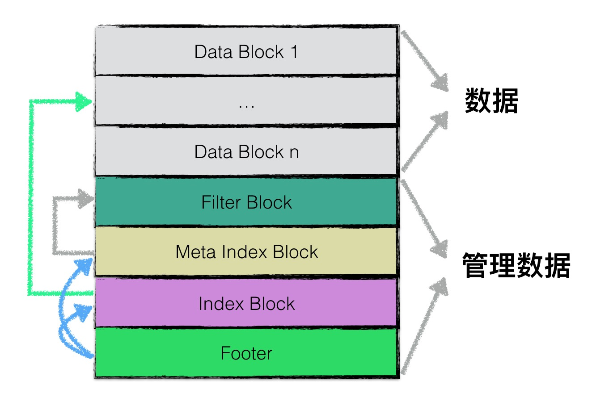
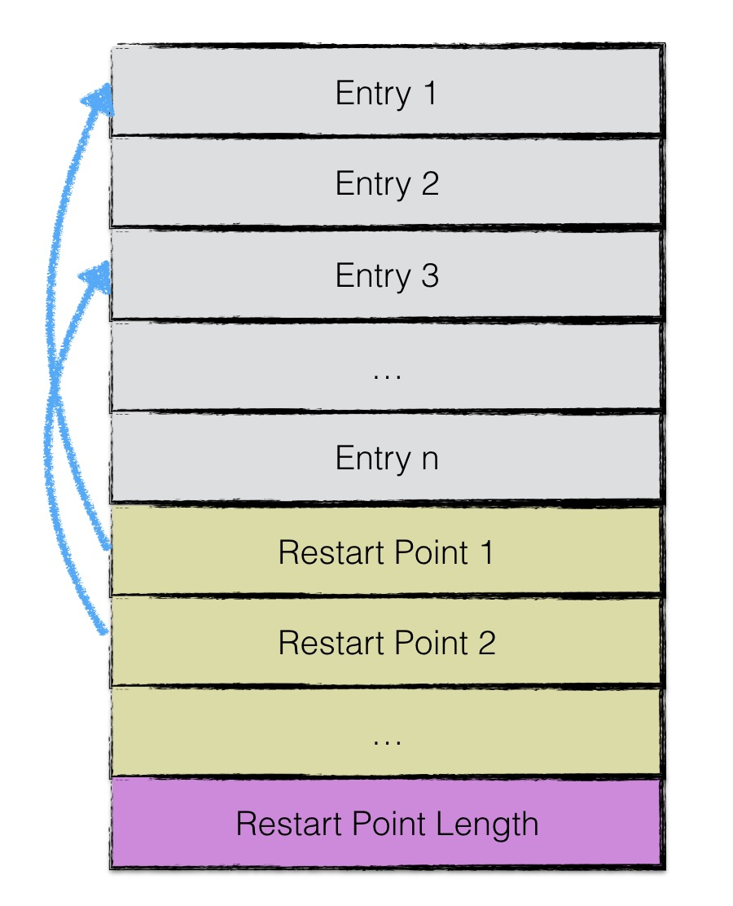
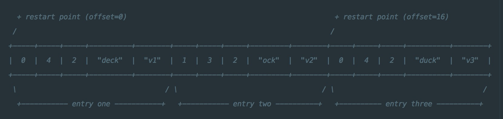
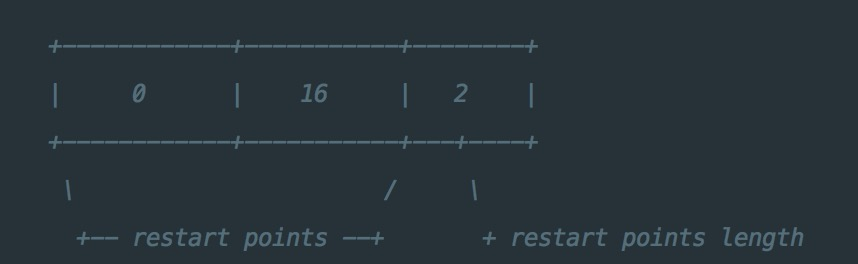
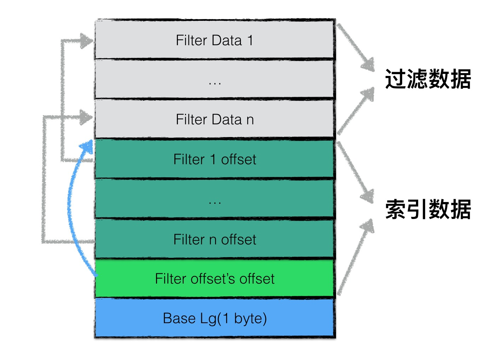
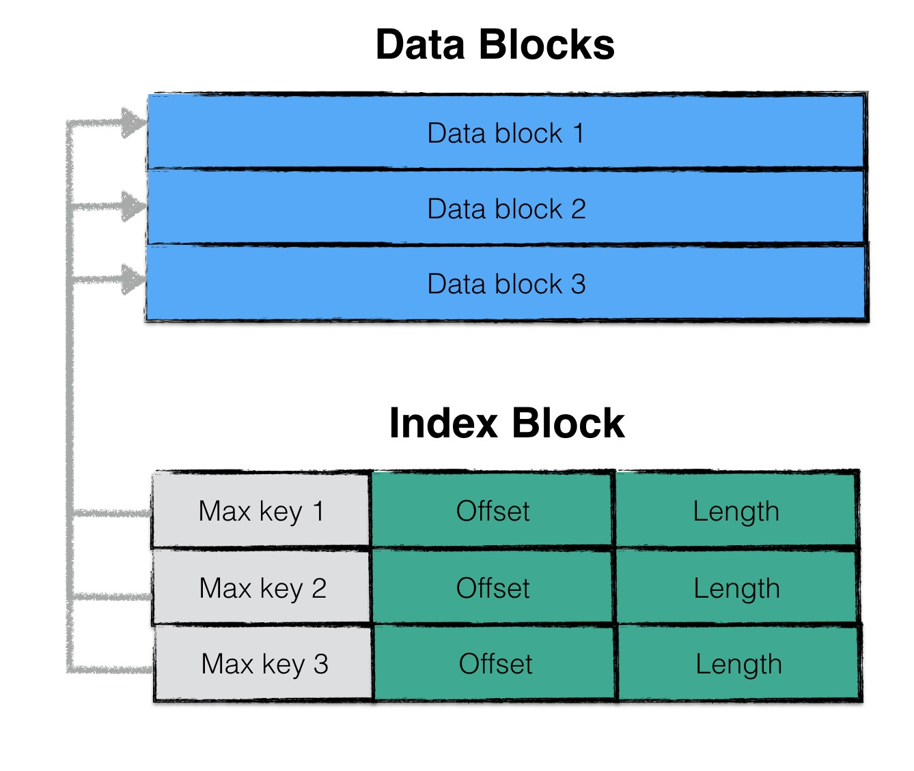
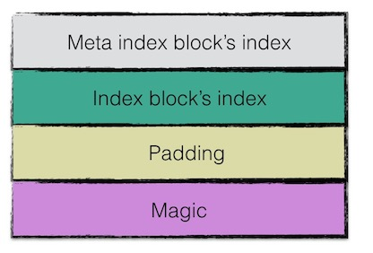

## sstable

### 概述

如我们之前提到的，leveldb是典型的LSM树(Log Structured-Merge Tree)实现，即一次leveldb的写入过程并不是直接将数据持久化到磁盘文件中，而是将写操作首先写入日志文件中，其次将写操作应用在memtable上。

当leveldb达到checkpoint点（memtable中的数据量超过了预设的阈值），会将当前memtable冻结成一个不可更改的内存数据库（immutable memory db），并且创建一个新的memtable供系统继续使用。

immutable memory db会在后台进行一次minor compaction，即将内存数据库中的数据持久化到磁盘文件中。

> 在这里我们暂时不展开讨论minor compaction相关的内容，读者可以简单地理解为将内存中的数据持久化到文件

leveldb（或者说LSM树）设计Minor Compaction的目的是为了：

1. 有效地降低内存的使用率；
2. 避免日志文件过大，系统恢复时间过长；

当memory db的数据被持久化到文件中时，leveldb将以一定规则进行文件组织，这种文件格式成为sstable。在本文中将详细地介绍sstable的文件格式以及相关读写操作。

### SStable文件格式

####物理结构

为了提高整体的读写效率，一个sstable文件按照固定大小进行块划分，默认每个块的大小为4KiB。每个Block中，除了存储数据以外，还会存储两个额外的辅助字段：

1. 压缩类型
2. CRC校验码

压缩类型说明了Block中存储的数据是否进行了数据压缩，若是，采用了哪种算法进行压缩。leveldb中默认采用[Snappy算法](https://github.com/google/snappy)进行压缩。

CRC校验码是循环冗余校验校验码，校验范围包括数据以及压缩类型。



#### 逻辑结构

在逻辑上，根据功能不同，leveldb在逻辑上又将sstable分为：

1. **data block**: 用来存储key value数据对；
2. **filter block**:  用来存储一些过滤器相关的数据（布隆过滤器），但是若用户不指定leveldb使用过滤器，leveldb在该block中不会存储任何内容；
3. **meta Index block**: 用来存储filter block的索引信息（索引信息指在该sstable文件中的偏移量以及数据长度）；
4. **index block**：index block中用来存储每个data block的索引信息；
5. **footer**: 用来存储meta index block及index block的索引信息；



注意，1-4类型的区块，其物理结构都是如1.1节所示，每个区块都会有自己的压缩信息以及CRC校验码信息。

### data block结构

data block中存储的数据是leveldb中的keyvalue键值对。其中一个data block中的数据部分（不包括压缩类型、CRC校验码）按逻辑又以下图进行划分：



第一部分用来存储keyvalue数据。由于sstable中所有的keyvalue对都是严格按序存储的，用了节省存储空间，leveldb并不会为每一对keyvalue对都存储完整的key值，而是存储与**上一个key非共享的部分**，避免了key重复内容的存储。

每间隔若干个keyvalue对，将为该条记录重新存储一个完整的key。重复该过程（默认间隔值为16），每个重新存储完整key的点称之为Restart point。

> leveldb设计Restart point的目的是在读取sstable内容时，加速查找的过程。
>
> 由于每个Restart point存储的都是完整的key值，因此在sstable中进行数据查找时，可以首先利用restart point点的数据进行键值比较，以便于快速定位目标数据所在的区域；
>
> 当确定目标数据所在区域时，再依次对区间内所有数据项逐项比较key值，进行细粒度地查找；
>
> 该思想有点类似于跳表中利用高层数据迅速定位，底层数据详细查找的理念，降低查找的复杂度。

每个数据项的格式如下图所示：


一个entry分为5部分内容：

1. 与前一条记录key共享部分的长度；
2. 与前一条记录key不共享部分的长度；
3. value长度；
4. 与前一条记录key非共享的内容；
5. value内容；

例如：

```
restart_interval=2
entry one  : key=deck,value=v1
entry two  : key=dock,value=v2
entry three: key=duck,value=v3	
```



三组entry按上图的格式进行存储。值得注意的是restart_interval为2，因此每隔两个entry都会有一条数据作为restart point点的数据项，存储完整key值。因此entry3存储了完整的key。

此外，第一个restart point为0（偏移量），第二个restart point为16，restart point共有两个，因此一个datablock数据段的末尾添加了下图所示的数据：



尾部数据记录了每一个restart point的值，以及所有restart point的个数。

### filter block结构

讲完了data block，在这一章节将展开讲述filter block的结构。

为了加快sstable中数据查询的效率，在直接查询datablock中的内容之前，leveldb首先根据filter block中的过滤数据判断指定的datablock中是否有需要查询的数据，若判断不存在，则无需对这个datablock进行数据查找。

filter block存储的是data block数据的一些过滤信息。这些过滤数据一般指代布隆过滤器的数据，用于加快查询的速度，关于布隆过滤器的详细内容，可以见《Leveldb源码分析 - 布隆过滤器》。



filter block存储的数据主要可以分为两部分：（1）过滤数据（2）索引数据。

其中索引数据中，` filter i offset`表示第i个filter data在整个filter block中的起始偏移量，`filter offset's offset`表示filter block的索引数据在filter block中的偏移量。

在读取filter block中的内容时，可以首先读出`filter offset's offset`的值，然后依次读取`filter i offset`，根据这些offset分别读出`filter data`。

Base Lg默认值为11，表示每2KB的数据，创建一个新的过滤器来存放过滤数据。控制filter data的大小也是为了避免一个IO读取过多的数据。

因为filter data比block data更小，所以读取IO消耗更小。

>leveldb中，特殊的sstable文件格式设计简化了许多操作，例如：
>
>索引和BloomFilter等元数据可随文件一起创建和销毁，即直接存在文件里，不用加载时动态计算，不用维护更新

### meta index block结构

meta index block用来存储filter block在整个sstable中的索引信息。

meta index block只存储一条记录：

该记录的key为：

​	"filter."与过滤器名字组成的常量字符串

该记录的value为：

​	filter block在sstable中的索引信息序列化后的内容，索引信息包括：（1）在sstable中的偏移量（2）数据长度。

### index block结构

与meta index block类似，index block用来存储所有data block的相关索引信息。

indexblock包含若干条记录，每一条记录代表一个data block的索引信息。

一条索引包括以下内容：

1. data block i 中最大的key值；
2. 该data block起始地址在sstable中的偏移量；
3. 该data block的大小；

>  其中，data block i最大的key值还是index block中该条记录的key值。
>
>  如此设计的目的是，依次比较index block中记录信息的key值即可实现快速定位目标数据在哪个data block中。




### footer结构

footer大小固定，为48字节，用来存储meta index block与index block在sstable中的索引信息，另外尾部还会存储一个magic word，内容为："http://code.google.com/p/leveldb/"字符串sha1哈希的前8个字节。




### 读写操作

在介绍完sstable文件具体的组织方式之后，我们再来介绍一下相关的读写操作。为了便于读者理解，将首先介绍写操作。

#### 写操作

sstable的写操作通常发生在：

* memory db将内容持久化到磁盘文件中时，会创建一个sstable进行写入；
* leveldb后台进行文件compaction时，会将若干个sstable文件的内容重新组织，输出到若干个新的sstable文件中；

对sstable进行写操作的数据结构为tWriter，具体定义如下：

```Go
// tWriter wraps the table writer. It keep track of file descriptor
// and added key range.
type tWriter struct {
	t *tOps

	fd storage.FileDesc // 文件描述符
	w  storage.Writer   // 文件系统writer
	tw *table.Writer

	first, last []byte
}
```

主要包括了一个sstable的文件描述符，底层文件系统的writer，该sstable中所有数据项最大最小的key值以及一个内嵌的tableWriter。

一次sstable的写入为一次不断利用迭代器读取需要写入的数据，并不断调用tableWriter的`Append`函数，直至所有有效数据读取完毕，为该sstable文件附上元数据的过程。

该迭代器可以是一个内存数据库的迭代器，写入情景对应着上述的第一种情况；

该迭代器也可以是一个sstable文件的迭代器，写入情景对应着上述的第二种情况；

> sstable的元数据包括：（1）文件编码（2）大小（3）最大key值（4）最小key值

故，理解tableWriter的`Append`函数是理解整个写入过程的关键。

**tableWriter**

在介绍append函数之前，首先介绍一下tableWriter这个数据结构。主要的定义如下：

```go
// Writer is a table writer.
type Writer struct {
	writer io.Writer
	// Options
	blockSize   int // 默认是4KiB

	dataBlock   blockWriter // data块Writer
	indexBlock  blockWriter // indexBlock块Writer
	filterBlock filterWriter // filter块Writer
	pendingBH   blockHandle 
	offset      uint64
	nEntries    int // key-value键值对个数
}
```

其中blockWriter与filterWriter表示底层的两种不同的writer，blockWriter负责写入data数据的写入，而filterWriter负责写入过滤数据。

pendingBH记录了上一个dataBlock的索引信息，当下一个dataBlock的数据开始写入时，将该索引信息写入indexBlock中。

**Append**

一次append函数的主要逻辑如下：

1. 若本次写入为新dataBlock的第一次写入，则将上一个dataBlock的索引信息写入；
2. 将keyvalue数据写入datablock;
3. 将过滤信息写入filterBlock；
4. 若datablock中的数据超过预定上限，则标志着本次datablock写入结束，将内容刷新到磁盘文件中；

```go
func (w *Writer) Append(key, value []byte) error {
	w.flushPendingBH(key)
	// Append key/value pair to the data block.
	w.dataBlock.append(key, value)
	// Add key to the filter block.
	w.filterBlock.add(key)

	// Finish the data block if block size target reached.
	if w.dataBlock.bytesLen() >= w.blockSize {
		if err := w.finishBlock(); err != nil {
			w.err = err
			return w.err
		}
	}
	w.nEntries++
	return nil
}
```

**dataBlock.append**

该函数将编码后的kv数据写入到dataBlock对应的buffer中，编码的格式如上文中提到的数据项的格式。此外，在写入的过程中，若该数据项为restart点，则会添加相应的restart point信息。

**filterBlock.append**

该函数将kv数据项的key值加入到过滤信息中，具体可见《Leveldb源码解析 - 布隆过滤器》

**finishBlock**

若一个datablock中的数据超过了固定上限，则需要将相关数据写入到磁盘文件中。

在写入时，需要做以下工作：

1. 封装dataBlock，记录restart point的个数；
2. 若dataBlock的数据需要进行压缩（例如snappy压缩算法），则对dataBlock中的数据进行压缩；
3. 计算checksum；
4. 封装dataBlock索引信息（offset，length）；
5. 将datablock的buffer中的数据写入磁盘文件；
6. 利用这段时间里维护的过滤信息生成过滤数据，放入filterBlock对用的buffer中；

**Close**

当迭代器取出所有数据并完成写入后，调用tableWriter的Close函数完成最后的收尾工作：

1. 若buffer中仍有未写入的数据，封装成一个datablock写入；
2. 将filterBlock的内容写入磁盘文件；
3. 将filterBlock的索引信息写入metaIndexBlock中，写入到磁盘文件；
4. 写入indexBlock的数据；
5. 写入footer数据；

至此为止，所有的数据已经被写入到一个sstable中了，由于**一个sstable是作为一个memory db或者Compaction的结果原子性落地的**，因此在sstable写入完成之后，将进行更为复杂的**leveldb的版本更新**，将在接下来的文章中继续介绍。

### 读操作

读操作作为写操作的逆过程，当充分理解了写操作，将会帮助理解读操作。

 
